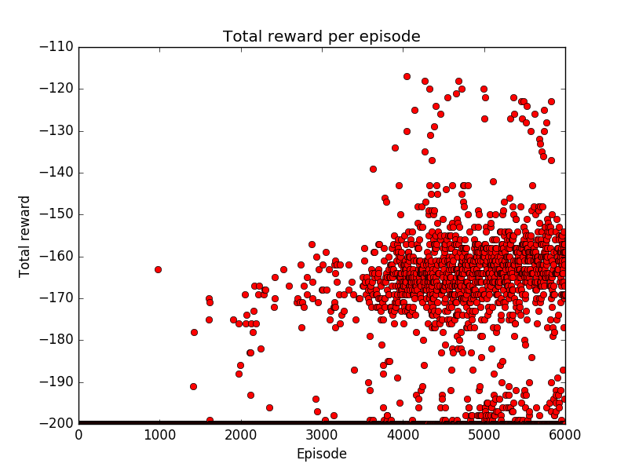

# DeepRL
This code is part of my master thesis at the VUB, Brussels.

## Status
Currently, the following parts are combined to learn to act in the [Mountain Car environment](https://gym.openai.com/envs/MountainCar-v0):
- Sarsa
- Eligibility traces
- EGreedy action selection policy
- Function approximation using tile coding

Example of a run after training with a total greedy action selection policy for 729 episodes of each 200 steps:


Total reward per episode:

Note that, after a few thousand episodes, the algorithm still isn't capable of consistently reaching the goal in less than 200 steps.


## How to run
First, install the requirements using [pip](https://pypi.python.org/pypi/pip):
```
pip install -r requirements.txt
```
Then you can run the experiment using:
```
python MountainCar.py <episodes_to_run> <monitor_target_directory>
```
