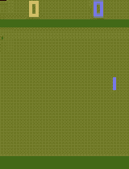

# Yet Another Reinforcement Learning Library (YARLL)

[](https://www.codacy.com/app/arnomoonens/DeepRL?utm_source=github.com&utm_medium=referral&utm_content=arnomoonens/DeepRL&utm_campaign=badger)

**Update 25/03/2019**: For now, the master branch won't get big changes. Instead, algorithms are adapted for TensorFlow 2 (and new ones may be added) on the [TF2 branch](https://github.com/arnomoonens/yarll/tree/tf2).<br />
**Update 29/10/2018**: New library name.<br />
**Update 25/10/2018**: Added [SAC implementation](./yarll/agents/sac.py).<br />

## Status

Different algorithms have currently been implemented (in no particular order):

- [Advantage Actor Critic](./yarll/agents/actorcritic/a2c.py)
- [Asynchronous Advantage Actor Critic (A3C)](./yarll/agents/actorcritic/a3c.py)
- [Deep Deterministic Policy Gradient (DDPG)](./yarll/agents/ddpg.py)
- [Proximal Policy Optimization (PPO)](./yarll/agents/ppo/ppo.py)
  - [Distributed version (DPPO)](./yarll/agents/ppo/dppo.py)
- [Soft Actor-Critic (SAC)](./yarll/agents/sac.py)
- [Trust Region Policy Optimization (TRPO)](./yarll/agents/trpo/trpo.py)
  - [Distributed version (DTRPO)](./yarll/agents/trpo/dtrpo.py)
- [REINFORCE](./yarll/agents/reinforce.py) (convolutional neural network part has not been tested yet)
- [Cross-Entropy Method](./yarll/agents/cem.py)
- [Sarsa with with function approximation and eligibility traces](./yarll/agents/sarsa/sarsa_fa.py)
- [Karpathy's policy gradient algorithm](./yarll/agents/karpathy.py) ([version using convolutional neural networks](./yarll/agents/karpathy_cnn.py) has not been tested yet)
- [(Sequential) knowledge transfer](./yarll/agents/knowledgetransfer/knowledge_transfer.py)
- [Asynchronous knowledge transfer](./yarll/agents/knowledgetransfer/async_knowledge_transfer.py)

## Asynchronous Advantage Actor Critic (A3C)

The code for this algorithm can be found [here](./yarll/agents/actorcritic/a3c.py).
Example run after training using 16 threads for a total of 5 million timesteps on the _PongDeterministic-v4_ environment:



## How to run

First, install the library using [pip](https://pypi.python.org/pypi/pip) (you can first remove _OpenCV_ from the `setup.py` file if it is already installed):

```Shell

pip install yarll

```

### Algorithms/experiments

You can run algorithms by passing the path to an experiment specification (which is a file in _json_ format) to `main.py`:

```Shell

python -m yarll.main <path_to_experiment_specification>

```

Examples of experiment specifications can be found in the [_experiment_specs_](./experiment_specs) folder.

### Statistics

Statistics can be plot using:

```Shell

python -m yarll.misc.plot_statistics <path_to_stats>

```

`<path_to_stats>` can be one of 2 things:

- A _json_ file generated using `gym.wrappers.Monitor`, in case it plots the episode lengths and total reward per episode.
- A directory containing _TensorFlow_ scalar summaries for different tasks, in which case all of the found scalars are plot.

Help about other arguments (e.g. for using smoothing) can be found by executing `python -m yarll.misc.plot_statistics -h`.

Alternatively, it is also possible to use [_Tensorboard_](https://www.tensorflow.org/get_started/summaries_and_tensorboard) to show statistics in the browser by passing the directory with the scalar summaries as `--logdir` argument.
