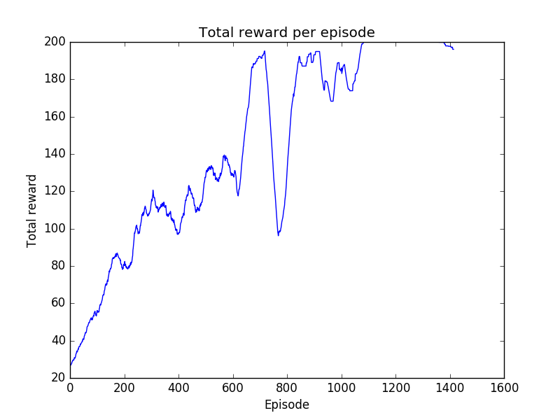

# Deep Reinforcement Learning

[](https://www.codacy.com/app/arnomoonens/DeepRL?utm_source=github.com&utm_medium=referral&utm_content=arnomoonens/DeepRL&utm_campaign=badger)

This code is part of [my master thesis](https://github.com/arnomoonens/Master-Thesis) at the [VUB](http://www.vub.ac.be), Brussels.

## Status
Different algorithms have currently been implemented:
- [Cross-Entropy Method](./agents/cem.py)
- [Sarsa with with function approximation and eligibility traces](./agents/sarsa_fa.py)
- [REINFORCE](./agents/reinforce.py) (convolutional neural network part has not been tested yet)
- [Karpathy's policy gradient algorithm](./agents/karpathy.py) ([version using convolutional neural networks](./agents/karpathy_cnn.py) has not been tested yet)
- [Advantage Actor Critic](./agents/a2c.py)
- [Asynchronous Advantage Actor Critic (A3C)](./agents/a3c.py)
- [(Sequential) knowledge transfer](./agents/knowledge_transfer.py)
- [Asynchronous knowledge transfer](./agents/async_knowledge_transfer.py)

### Sarsa + function approximation
The following parts are combined to learn to act in the [_Mountain Car_ environment](https://gym.openai.com/envs/MountainCar-v0):
- Sarsa
- Eligibility traces
- epsilon-greedy action selection policy
- Function approximation using tile coding

Example of a run after training with a total greedy action selection policy for 729 episodes of each 200 steps:


Total reward per episode:


Note that, after a few thousand episodes, the algorithm still isn't capable of consistently reaching the goal in less than 200 steps.

### REINFORCE
Adapted version of [this code](http://rl-gym-doc.s3-website-us-west-2.amazonaws.com/mlss/pg-startercode.py) in order to work with [_Tensorflow_](https://www.tensorflow.org/).
Total reward per episode when applying this algorithm on the [_CartPole-v0_ environment](https://gym.openai.com/envs/CartPole-v0):


### Karpathy Policy Gradient
Adapted version of the code of [this article](http://karpathy.github.io/2016/05/31/rl/) of Andrej Karpathy.
Total reward per episode when applying this algorithm on the [_CartPole-v0_ environment](https://gym.openai.com/envs/CartPole-v0):


How quickly the optimal reward is reached and kept heavily varies however because of randomness. Results of an earlier execution are also posted on the [OpenAI Gym](https://gym.openai.com/evaluations/eval_dyl7JQpTXGXY4lIe0pSA).

### Advantage Actor Critic
Total reward per episode when applying this algorithm on the [_CartPole-v0_ environment](https://gym.openai.com/envs/CartPole-v0):


[OpenAI Gym page](https://gym.openai.com/evaluations/eval_8lGn053RQref7asqoiPPw)

### Asynchronous Advantage Actor Critic
Total reward per episode when applying this algorithm on the [_CartPole-v0_ environment](https://gym.openai.com/envs/CartPole-v0):


This only shows the results of one of the A3C threads.
Results of another execution are also posted on the [OpenAI Gym](https://gym.openai.com/evaluations/eval_deHd1IsvTQeWAnEaSvvkg).
Results of an execution using the _Acrobot-v1_ environment can also be found [on OpenAI Gym](https://gym.openai.com/evaluations/eval_Ig1wrPzQlGipmBAhZ5Tw).
## How to run
First, install the requirements using [pip](https://pypi.python.org/pypi/pip):
```
pip install -r requirements.txt
```

### Algorithms/experiments
You can run algorithms by passing an experiment specification (in _json_ format) to `main.py`:
```
python main.py <experiment_description>
```
[Example of an experiment specification](./experiment_spec_example.json)

### Statistics
Statistics can be plot using:
```
python misc/plot_statistics.py <path_to_stats>
```
`<path_to_stats>` can be one of 2 things:
- A _json_ file generated using `gym.wrappers.Monitor`, in case it plots the episode lengths and total reward per episode.
- A directory containing _TensorFlow_ scalar summaries for different tasks, in which case all of the found scalars are plot.

Help about other arguments (e.g. for using smoothing) can be found by executing `python misc/plot_statistics.py -h`.

Alternatively, it is also possible to use _Tensorboard_ to show statistics in the browser by passing the directory with the scalar summaries as `logdir` argument.
