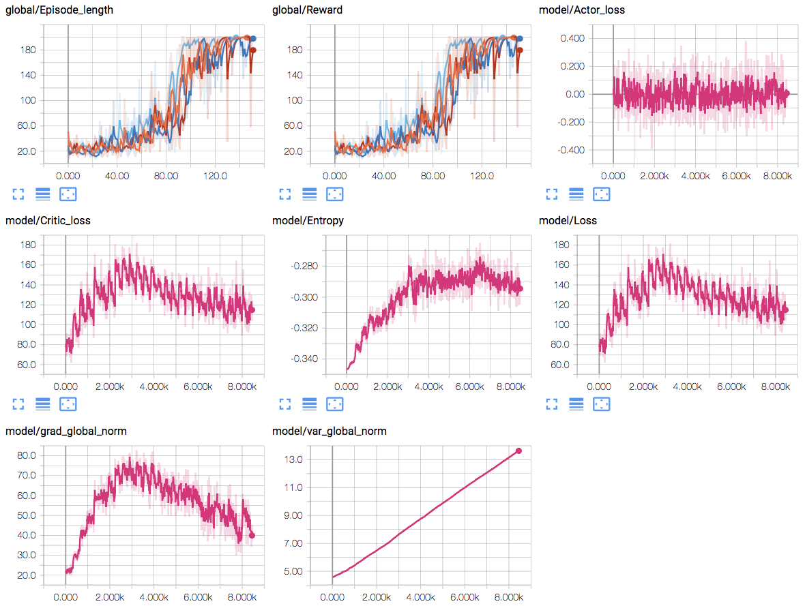
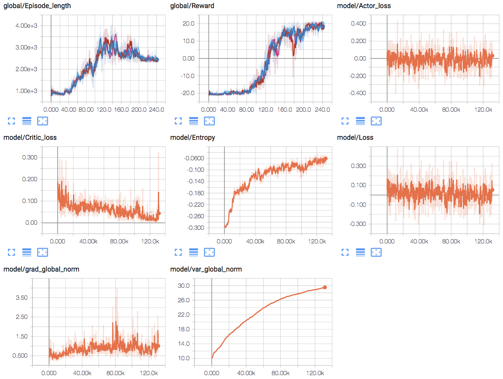

# Proximal policy optimization algorithms

Two versions have been implemented: One with a single actor that gathers trajectories and one with multiple actors.

## Single actor

This one just runs the environment for a number of timesteps, uses minibatches to learn on this data, and starts over.

## Distributed Proximal Policy Optimization

This version uses multiple processes where actors gather data from different instances of the same environment. This is done using [Open MPI](https://www.open-mpi.org) and [mpi4py](http://mpi4py.readthedocs.io/en/stable/).

Here, the master broadcasts the network to all the workers and waits until they executed a predefined number of timesteps. Afterwards, it gathers this data and learns just like the single agent version. Then, the process starts again.

Make sure to run the experiment like this (when being in the `DeepRL` project folder):

```Shell

mpirun -np 1 python main.py --monitor_path MONITOR_PATH --seed SEED EXPERIMENT_DESCRIPTION_PATH.json

```

Where the parameters in capital are replaced by your own values.

Below, some graphs of the learning process can be seen. `Episode_length` and `Reward` are summaries provided by the actors. On the x-axis are the number of episodes ran by **each** agent.
The other summaries are provided by the master. On the x-axis is each time the amount of updates to the networks.

### Experiment on _CartPole-v0_

The graphs for this environment can be seen below:


### Experiment on _PongDeterministic-v4_

The graphs for this environment can be seen below:


## TODO

- Fix PPO with state normalization.
- Add learner that uses an RNN.
- Add histogram and distributions to DPPO summaries.
