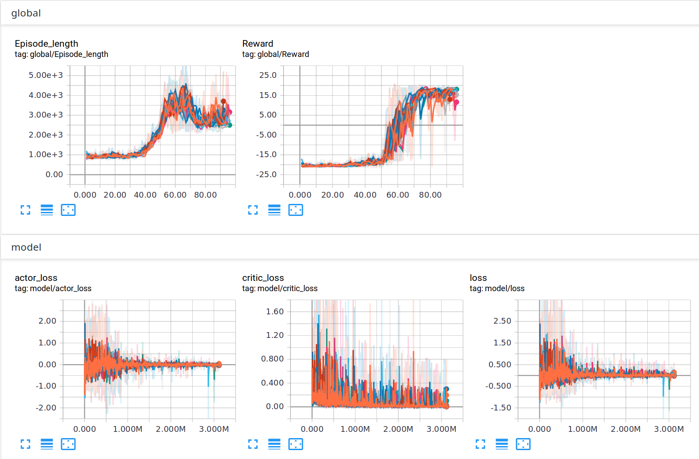

# Actor-Critic algorithms

## A3C plots

Plots for running A3C on `PongDeterministic-v4` using 16 actors.

The amount of episodes (on the x-axis) for the reward and episode length plots are per-actor, so this amount should be multiplied by the number of actors, 16. The experiment was run for 36m20 (computer specs to be added).

